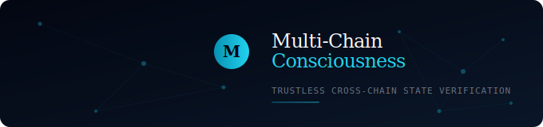

<p align="center">
  
</p>

<h1 align="center">Multi-Chain Consciousness</h1>

<p align="center">
  <strong>Trustless cross-chain state verification via zero-knowledge proofs</strong>
</p>

<p align="center">
  <a href="https://github.com/sildl/mcc-protocol/actions/workflows/test.yml">
    
  </a>
  <a href="https://github.com/sildl/mcc-protocol/actions/workflows/slither.yml">
    
  </a>
  
  
  <a href="https://discord.gg/YOUR_INVITE">
    
  </a>
</p>

<p align="center">
  <a href="#quickstart">Quickstart</a> &nbsp;·&nbsp;
  <a href="#architecture">Architecture</a> &nbsp;·&nbsp;
  <a href="#contracts">Contracts</a> &nbsp;·&nbsp;
  <a href="sdk/">SDK</a> &nbsp;·&nbsp;
  <a href="CONTRIBUTING.md">Contributing</a> &nbsp;·&nbsp;
  <a href="SECURITY.md">Security</a>
</p>

---

## What is MCC?

MCC is a Layer-0 protocol that lets any blockchain **read any other blockchain's state** — without bridges, oracles, or wrapped tokens.

Instead of moving assets between chains (dangerous), MCC **proves state** using zero-knowledge proofs. An Ethereum smart contract can verify a wallet's Solana balance, Bitcoin UTXOs, or Polygon contract state in under 200ms with cryptographic guarantees equivalent to on-chain finality.

```typescript
import { MCCClient } from "@mcc-protocol/sdk";

// Query a Solana balance from Ethereum — no bridge needed
const result = await client.queryBalance(2n, "0x742d...");
console.log(result.verified);    // true
console.log(result.blockHeight); // 298410056n
console.log(result.stateRoot);   // 0x8a3f...
```

## Why?

Cross-chain bridges have lost **$2.5B+** to exploits (Ronin $625M, Wormhole $320M, Nomad $190M). They're centralized weak points bolted onto decentralized systems.

MCC eliminates the need for bridges entirely. If you can **prove** state, you don't need to **transfer** it.

| | Bridges | MCC |
|---|---|---|
| Trust model | Trusted validators | Math only (ZK proofs) |
| Attack surface | Single contract | Distributed mesh |
| Asset movement | Lock + mint IOUs | None — state is read |
| Latency | Minutes to hours | < 200 milliseconds |
| Failure mode | Total fund loss | Stale reads (no fund loss) |

---

<h2 id="architecture">Architecture</h2>

```
┌─────────────────────────────────────────────────────────────┐
│                    Connected Blockchains                     │
│           Ethereum · Solana · Bitcoin · Polygon              │
└──────────┬──────────────┬──────────────┬───────────────┬────┘
           │              │              │               │
     ┌─────▼─────┐  ┌────▼─────┐  ┌────▼─────┐  ┌─────▼────┐
     │  SPN ETH  │  │ SPN SOL  │  │ SPN BTC  │  │ SPN POLY │
     └─────┬─────┘  └────┬─────┘  └────┬─────┘  └─────┬────┘
           │              │              │               │
           ▼              ▼              ▼               ▼
     ┌─────────────────────────────────────────────────────────┐
     │                     Neural Mesh                         │
     │  ┌──────────────┐ ┌─────────────┐ ┌──────────────────┐ │
     │  │ State Proof   │ │  Synapse    │ │  CoC Validators  │ │
     │  │ Store         │ │  Protocol   │ │  (Staking/Slash) │ │
     │  └──────────────┘ └──────┬──────┘ └──────────────────┘ │
     └──────────────────────────┼──────────────────────────────┘
                                │
                          ┌─────▼─────┐
                          │   dApps   │
                          │ (SDK/API) │
                          └───────────┘
```

**State Proof Neurons (SPNs)** — lightweight nodes that compress each chain's full state into ~200 byte ZK proofs

**Neural Mesh** — shared awareness layer that stores and serves verified state proofs

**Synapse Protocol** — developer API for cross-chain state queries with cryptographic verification

**Consensus of Consciousness (CoC)** — validators that secure cross-chain state relationships

---

<h2 id="contracts">Contracts</h2>

| Contract | Description | Size |
|---|---|---|
| [`SyncToken`](contracts/token/SyncToken.sol) | ERC-20 + EIP-2612 permits + burn + halving emission | 10.5 KB |
| [`SyncVesting`](contracts/token/SyncVesting.sol) | Linear vesting with cliff + revocation | 5.2 KB |
| [`StateProofStore`](contracts/core/StateProofStore.sol) | Neural Mesh — ZK proof storage + indexing | 10.2 KB |
| [`CoCValidator`](contracts/core/CoCValidator.sol) | Validator staking, slashing, epoch rewards | 10.2 KB |
| [`SynapseProtocol`](contracts/core/SynapseProtocol.sol) | Cross-chain query engine (developer API) | 7.0 KB |
| [`Groth16Verifier`](contracts/core/Groth16Verifier.sol) | On-chain ZK-SNARK verification (bn128 precompiles) | 5.2 KB |

All contracts use [OpenZeppelin](https://openzeppelin.com/contracts) v4.9 for `AccessControl`, `ReentrancyGuard`, `Pausable`, and `SafeERC20`.

---

<h2 id="quickstart">Quickstart</h2>

```bash
# Clone
git clone https://github.com/sildl/mcc-protocol.git
cd mcc-protocol

# Install
npm install

# Compile
npx hardhat compile

# Test (35 unit + invariant tests)
npx hardhat test

# Coverage
npx hardhat coverage

# Static analysis
pip install slither-analyzer
slither . --config-file slither.config.json

# Deploy to Sepolia testnet
cp .env.example .env    # edit with your keys
npx hardhat run scripts/deploy.js --network sepolia
```

### SDK

```bash
cd sdk
npm install
npm run build
```

See [`sdk/README.md`](sdk/README.md) for the full API reference.

---

## Security

MCC takes security seriously. See [`SECURITY.md`](SECURITY.md) for our vulnerability disclosure policy.

| Feature | Implementation |
|---|---|
| Access control | OpenZeppelin `AccessControl` with role-based permissions |
| Reentrancy | `ReentrancyGuard` on all state-changing externals |
| Pausability | Circuit breaker on all critical operations |
| Safe transfers | `SafeERC20` for all token interactions |
| Custom errors | Gas-efficient reverts with typed error data |
| ZK verification | Groth16 via bn128 precompiles (EIP-196/197) |

See [`AUDIT_PREP.md`](AUDIT_PREP.md) for known considerations and the security review checklist.

---

## Roadmap

| Phase | Timeline | Status |
|---|---|---|
| **Spark** — Testnet with EVM chain SPNs | Q3 2026 | `In Progress` |
| **Synapse** — Non-EVM chains (Solana, Bitcoin) | Q1 2027 | Planned |
| **Cortex** — Mainnet + SYNC token launch | Q3 2027 | Planned |
| **Awakening** — Chain SDK + 20 chains live | Q1 2028 | Planned |
| **Singularity** — Full cross-chain composability | Q3 2028 | Planned |

---

## Documentation

| Document | Description |
|---|---|
| [`LAUNCH_PLAYBOOK.md`](LAUNCH_PLAYBOOK.md) | Complete mainnet launch guide (8 phases) |
| [`GAS_OPTIMIZATION.md`](GAS_OPTIMIZATION.md) | Gas optimization report with estimates |
| [`AUDIT_PREP.md`](AUDIT_PREP.md) | Security audit preparation and risk analysis |
| [`sdk/README.md`](sdk/README.md) | TypeScript SDK API reference |
| [`.env.example`](.env.example) | Environment configuration template |

---

## Contributing

We welcome contributions! See [`CONTRIBUTING.md`](CONTRIBUTING.md) for guidelines.

Good first issues are labeled [`good first issue`](https://github.com/sildl/mcc-protocol/labels/good%20first%20issue).

---

## License

[MIT](LICENSE)

---

<p align="center">
  <sub>Built for the multi-chain future. Each chain specialized. Each sovereign. Each aware of the others.</sub>
</p>
